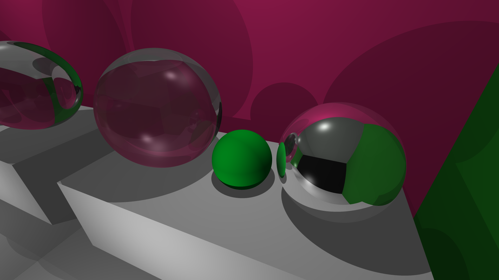
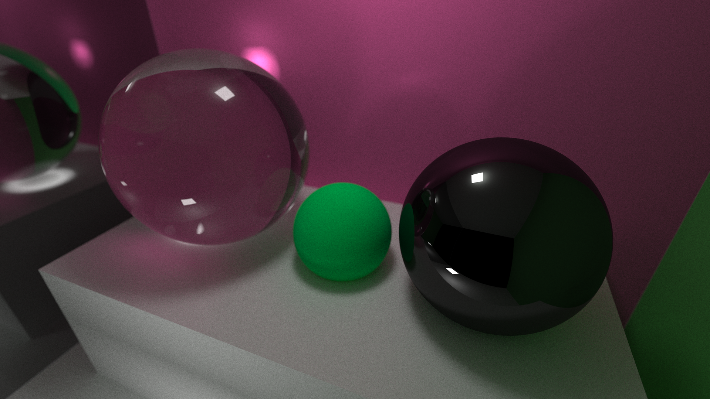

# GPU Ray Tracer Concepts

This document explains the key concepts and algorithms used in this GPU ray tracer implementation, featuring a XML scene loading system and advanced camera features.

## Ray Tracing Fundamentals

### What is Ray Tracing?
Ray tracing is a rendering technique that simulates the way light travels in the real world. It works by:
1. Casting rays from the camera through each pixel
2. Following those rays as they bounce off objects
3. Calculating the final color based on material properties and lighting

### Path Tracing
Path tracing is a specific type of ray tracing that uses Monte Carlo integration to solve the rendering equation. It:
- Traces multiple rays per pixel for anti-aliasing
- Uses random sampling to simulate global illumination
- Converges to the correct solution as sample count increases

## Monte Carlo Integration

### Why Monte Carlo?
This project implements **Monte Carlo Path Tracing**, a modern approach to ray tracing that produces significantly more realistic results compared to traditional **Whitted Ray Tracing**.

The rendering equation is an integral that's difficult to solve analytically. Monte Carlo integration:
- Approximates integrals using random sampling
- Provides unbiased estimates
- Works well with high-dimensional problems

#### Monte Carlo vs Whitted Ray Tracing

**Whitted Ray Tracing** (1979) was one of the first practical ray tracing algorithms. It traces rays only for:
- Direct lighting (shadows)
- Perfect mirror reflections
- Perfect refraction

**Monte Carlo Path Tracing** (1986) is a more advanced technique that:
- Simulates global illumination by tracing many random light paths
- Handles diffuse reflections realistically
- Accounts for indirect lighting and color bleeding
- Produces physically accurate lighting

Here's a comparison of the same scene rendered with both techniques:

<p align="center">
  
</p>
<p align="center"><em>Whitted Ray Tracing - Limited to direct lighting and perfect reflections</em></p>

<p align="center">
  
</p>
<p align="center"><em>Monte Carlo Path Tracing - Realistic global illumination and soft lighting</em></p>

**Key Differences:**
- **Realism**: Monte Carlo produces much more realistic lighting with soft shadows, color bleeding, and indirect illumination
- **Performance**: Monte Carlo requires thousands of samples per pixel vs. just a few rays in Whitted
- **Noise**: Monte Carlo produces noise that converges to the correct result with more samples
- **Materials**: Monte Carlo handles all material types realistically, while Whitted only works well with perfect mirrors/glass

The dramatic improvement in visual quality comes with significant computational cost, which is why GPU acceleration is essential for practical Monte Carlo rendering.

### Implementation
```cpp
// For each pixel, take multiple samples
for (int s = 0; s < samples_per_pixel; ++s) {
    // Generate random ray direction
    auto u = (i + random_float()) / (width-1);
    auto v = (j + random_float()) / (height-1);
    ray r = cam.get_ray(u, v);
    
    // Accumulate color
    pixel_color += ray_color(r, world, max_depth);
}

// Average the samples
auto scale = 1.0f / samples_per_pixel;
final_color = scale * pixel_color;
```

### Scene Loading Process
1. **XML Parsing**: TinyXML2 library parses scene definition
2. **Material Creation**: Materials are created and stored with unique IDs
3. **Object Creation**: Objects reference materials by ID
4. **GPU Allocation**: Scene data is allocated and copied to GPU memory
5. **Rendering**: CUDA kernel processes the scene

## Advanced Camera System

### Depth of Field Implementation
The camera system implements realistic depth of field effects:

#### Aperture and Focus
```cpp
class camera {
    point3 origin;
    point3 lower_left_corner;
    vec3 horizontal;
    vec3 vertical;
    vec3 u, v, w;
    float lens_radius;
    float focus_distance;
    
    ray get_ray(float s, float t) const {
        vec3 rd = lens_radius * random_in_unit_disk();
        vec3 offset = u * rd.x() + v * rd.y();
        
        return ray(origin + offset,
                   lower_left_corner + s*horizontal + t*vertical - origin - offset);
    }
};
```

#### Bokeh Effect
- **Lens Radius**: Controls the amount of blur (larger = more blur)
- **Focus Distance**: Objects at this distance appear sharp
- **Random Disk Sampling**: Creates realistic lens aperture simulation

## CUDA Implementation

### Kernel Structure
```cpp
__global__ void render_kernel_quads_and_spheres(color* image, int width, int height, 
                                               int samples_per_pixel, quad* quads, 
                                               int num_quads, sphere* spheres, 
                                               int num_spheres, camera cam) {
    // Each thread handles one pixel
    int i = blockIdx.x * blockDim.x + threadIdx.x;
    int j = blockIdx.y * blockDim.y + threadIdx.y;
    
    if (i >= width || j >= height) return;
    
    // Render pixel (i, j) with both quads and spheres
    // ...
}
```

### Memory Management
- **Host Memory**: Scene objects, materials, XML parsing
- **Device Memory**: Object arrays, material pointers, image buffer
- **Memory Transfers**: Host to device for scene data, device to host for result
- **Unified Allocation**: Contiguous arrays for efficient memory access

### Random Number Generation
- Each thread has its own random state
- Uses CUDA's curand library
- Ensures reproducible results with proper seeding

## Scene Representation

### Primitive Types

#### Sphere Primitive
```cpp
struct sphere {
    point3 center;
    float radius;
    material* mat_ptr;
};
```
- **Intersection**: Quadratic equation solution
- **Normal**: Direction from center to intersection point
- **Usage**: Spherical objects, ground planes (large radius)

#### Quad Primitive
```cpp
struct quad {
    point3 Q;           // Corner point
    vec3 u, v;          // Edge vectors
    material* mat_ptr;
    vec3 normal;        // Precomputed normal
    float D;            // Plane equation constant
    float w_area;       // Reciprocal area
};
```
- **Intersection**: Ray-plane intersection with bounds checking
- **Normal**: Precomputed for efficiency
- **Usage**: Walls, floors, ceilings, area lights

#### Box Primitive
- The `<box>` element allows you to define a rectangular prism by center, size, rotation (y-axis), and material.
- The parser generates the 6 quads for the box.

### Material System
The material system uses type tags instead of virtual functions for CUDA compatibility:

```cpp
enum material_type { LAMBERTIAN, METAL, DIELECTRIC, EMISSIVE };

struct material {
    material_type type;
    // Union or additional fields for material-specific data
};

struct lambertian {
    material_type type = LAMBERTIAN;
    color albedo;
};

struct metal {
    material_type type = METAL;
    color albedo;
    float fuzz;
};

struct dielectric {
    material_type type = DIELECTRIC;
    float ir;  // Index of refraction
};

struct emissive {
    material_type type = EMISSIVE;
    color emit;
};
```

## Light-Material Interaction

### Reflection
Reflection occurs when light bounces off a surface. The **law of reflection** states that the angle of incidence equals the angle of reflection:

```
incident_angle = reflected_angle
```

In ray tracing, reflection is calculated using the formula:
```cpp
vec3 reflect(const vec3& v, const vec3& n) {
    return v - 2*dot(v,n)*n;
}
```

Where:
- `v` is the incident ray direction
- `n` is the surface normal
- The result is the reflected ray direction

### Reflectance (Fresnel Effect)
The **Fresnel effect** describes how the amount of light reflected from a surface depends on the viewing angle. At glancing angles, more light is reflected.

This project uses **Schlick's approximation** for computational efficiency:
```cpp
float reflectance(float cosine, float ref_idx) {
    auto r0 = (1 - ref_idx) / (1 + ref_idx);
    r0 = r0 * r0;
    return r0 + (1 - r0) * powf((1 - cosine), 5);
}
```

Where:
- `cosine` is the cosine of the angle between the incident ray and surface normal
- `ref_idx` is the refractive index of the material
- The result is the fraction of light reflected (0.0 to 1.0)

**Physical interpretation:**
- At normal incidence (cosine = 1), reflectance is minimal
- At glancing angles (cosine = 0), reflectance approaches 1.0
- The `r0` term represents reflectance at normal incidence

### Refraction
Refraction occurs when light passes through a transparent material and changes direction. It's governed by **Snell's law**:

```
n₁ * sin(θ₁) = n₂ * sin(θ₂)
```

Where:
- `n₁, n₂` are the refractive indices of the two media
- `θ₁, θ₂` are the angles of incidence and refraction

In ray tracing, refraction is implemented as:
```cpp
vec3 refract(const vec3& uv, const vec3& n, float etai_over_etat) {
    auto cos_theta = fmin(dot(-uv, n), 1.0f);
    vec3 r_out_perp = etai_over_etat * (uv + cos_theta*n);
    vec3 r_out_parallel = -sqrt(fabs(1.0f - r_out_perp.length_squared())) * n;
    return r_out_perp + r_out_parallel;
}
```

> We also have to keep in mind that the ray sometimes cannot be refracted (Total Internal Reflection). This occurs when `etai_over_etat * sin(θ₁) > 1`.

### Material-Specific Behavior

#### Metals
- **High reflectance** at all angles due to free electrons
- **Colored reflections** based on material properties
- **No transmission** (opaque materials)

#### Dielectrics (Glass, Water)
- **Angle-dependent reflectance** (Fresnel effect)
- **Transmission** with refraction
- **Total internal reflection** at steep angles
- **Color-independent**

#### Lambertian (Diffuse)
- **No specular reflection**
- **Cosine-weighted scattering** for realistic diffuse appearance
- **No transmission**

### Implementation in Materials

Each material type implements these effects differently:

```cpp
// Metal: Always reflects with Fresnel enhancement
attenuation = mat->albedo * (0.3f + 0.7f * fresnel);

// Dielectric: Fresnel-based reflection vs refraction
if (cannot_refract || fresnel_prob > rand_val) {
    direction = reflect(unit_direction, rec.normal);
} else {
    direction = refract(unit_direction, rec.normal, refraction_ratio);
}
```


## Performance Considerations

### Parallelization
- Each pixel is processed by a separate GPU thread
- No dependencies between pixels
- Excellent for GPU parallelization

### Memory Access Patterns
- Coalesced memory access for image buffer
- Object data stored in contiguous arrays
- Efficient memory layout for multiple primitive types

### Optimization Techniques
- Early ray termination
- Unified scene system reduces kernel overhead
- Efficient material type checking with tags
- Multiple primitive support in single kernel

## BVH Acceleration Structure

The ray tracer now includes a **Bounding Volume Hierarchy (BVH)** acceleration structure that provides significant performance improvements for scenes with many objects.

### Key Features:
- **O(log n) Complexity**: Instead of testing every object linearly (O(n)), the BVH reduces intersection tests to logarithmic complexity.
- **Automatic Construction**: BVH is built automatically from scene objects during scene loading.
- **GPU-Optimized**: The BVH traversal is implemented on the GPU for maximum performance.
- **Support for All Primitives**: Works with spheres, quads, and boxes.

### Performance Benefits:
- **Scenes with many objects**: The BVH provides dramatic speedups for complex scenes
- **Spatial locality**: Objects that are spatially close are grouped together in the hierarchy
- **Early termination**: Ray-box tests allow early rejection of entire subtrees

### Test Scene:
- **BVH Test Scene (`scenes/bvh_test.xml`)**: Contains 50+ objects in a grid pattern to demonstrate BVH performance improvements.
