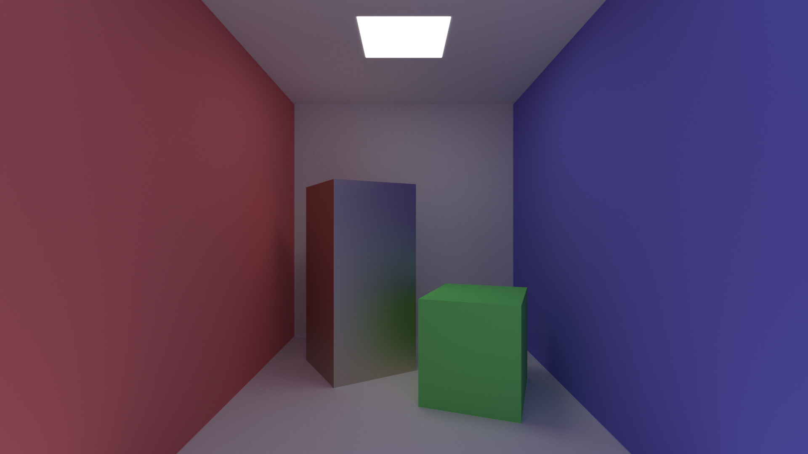

# GPU Ray Tracer with CUDA

<p align="center">
  
</p>
<p align="center">Render of a Cornell Box scene produced by this ray tracer.</p>

A high-performance ray tracer implemented using CUDA and C++ with path tracing and Monte Carlo integration, featuring pure XML scene loading and advanced material system.

## Current Implementation Status

### ✅ **Working Features**
- **Path Tracing**: Physically-based rendering using Monte Carlo path tracing
- **Multiple Primitives**: Sphere, quad, and box (rectangular prism) primitives
- **Material System**: Lambertian (diffuse), Metal, Dielectric (glass), and Emissive materials
- **Camera System**: Configurable camera with depth of field, aperture, and focus distance
- **GPU Acceleration**: CUDA kernels for parallel ray tracing
- **Output Generation**: PNG image format using stb_image_write
- **Scene Management**: Scene controller for loading and managing XML scenes

### 🔄 **Planned Features**
- Additional primitives (triangles, meshes)
- Advanced materials (subsurface scattering, anisotropic)
- Real-time preview and interactive scene editing
- Advanced camera effects (motion blur, lens effects)

## Project Structure

```
gpu-ray-tracer/
├── include/
│   ├── core/
│   │   ├── vec3.h              # 3D vector operations
│   │   ├── constants.h         # Project-wide constants
│   │   ├── cuda_utils.h        # CUDA utility functions
│   │   └── cuda_random.h       # CUDA random number utilities
│   ├── geometry/
│   │   ├── ray.h               # Ray definition
│   │   ├── hit_record.h        # Intersection information
│   │   ├── hittable.h          # Hittable interface
│   │   ├── sphere.h            # Sphere primitive
│   │   ├── quad.h              # Quad primitive
│   │   └── box.h               # Box primitive
│   ├── materials/
│   │   ├── material.h          # Material system (Lambertian, Metal, Dielectric, Emissive)
│   │   └── material_device.h   # Device-side material logic
│   ├── scene/
│   │   ├── camera.h            # Camera system with depth of field
│   │   ├── scene_controller.h  # XML scene loading and management
│   │   └── xml_scene_parser.h  # XML parsing utilities
│   ├── image/
│   │   └── image_writer.h      # PNG image output functions
│   ├── third_party/
│   │   ├── stb_image_write.h   # PNG image output (external)
│   │   └── tinyxml2/
│   │       └── tinyxml2.h      # TinyXML2 library headers
│   └── renderer.h              # Rendering interface and logic
├── src/
│   ├── main.cpp                # Main entry point with XML scene selection
│   ├── renderer.cpp            # Rendering implementation
│   ├── scene_controller.cpp    # Scene loading and management
│   ├── xml_scene_parser.cpp    # XML parsing implementation
│   ├── tinyxml2.cpp            # TinyXML2 library implementation
│   ├── image_writer.cpp        # PNG image output functions
│   └── gpu_raytracer.cu        # CUDA kernel implementation
├── scenes/
│   ├── minimal.xml             # Simple scene with two spheres
│   ├── complex.xml             # Multiple spheres with different materials
│   └── cornell_box.xml         # Cornell Box scene
├── renders/                    # High-quality example renders (PNG)
│   └── ...                     # Example output images
├── CMakeLists.txt              # Build configuration
├── build.bat                   # Windows build script
└── build.sh                    # Linux/Mac build script
```

## Prerequisites

- CUDA Toolkit (version 10.0 or higher)
- CMake (version 3.18 or higher)
- C++ compiler with C++17 support
- NVIDIA GPU with compute capability 6.0 or higher

## Building the Project

### Windows
```bash
.\build.bat
```

### Linux/Mac
```bash
./build.sh
```

### Manual Build
1. **Create build directory**:
   ```bash
   mkdir build
   cd build
   ```

2. **Configure with CMake**:
   ```bash
   cmake ..
   ```

3. **Build the project**:
   ```bash
   cmake --build . --config Release
   ```

4. **Run the ray tracer**:
   ```bash
   ./bin/Release/gpu_raytracer
   ```

## XML Scene System

The ray tracer uses **pure XML scene loading** - all scenes are defined in XML files.

### Benefits
- **No Code Changes**: New scenes can be created without recompiling
- **Easy Configuration**: Camera, materials, and objects defined in XML
- **Reusable Components**: Materials can be referenced by multiple objects

### XML Scene Format

```xml
<?xml version="1.0" encoding="UTF-8"?>
<scene name="scene_name">
  <render>
    <image_width>1280</image_width>
    <image_height>720</image_height>
    <samples_per_pixel>1500</samples_per_pixel>
  </render>
  <camera>
    <position x="0" y="0" z="0"/>
    <look_at x="0" y="0" z="-1"/>
    <up x="0" y="1" z="0"/>
    <fov>90</fov>
    <aspect_ratio>auto</aspect_ratio>
    <aperture>0.1</aperture>
    <focus_distance>3.0</focus_distance>
  </camera>
  
  <materials>
    <material id="red" type="lambertian">
      <color r="0.7" g="0.3" b="0.3"/>
    </material>
    <material id="metal" type="metal">
      <color r="0.8" g="0.8" b="0.9"/>
      <fuzz>0.3</fuzz>
    </material>
  </materials>
  
  <objects>
    <sphere material="red">
      <center x="0" y="0" z="-3"/>
      <radius>0.5</radius>
    </sphere>
    <quad material="red">
      <corner x="-5" y="-5" z="-5"/>
      <u_edge x="10" y="0" z="0"/>
      <v_edge x="0" y="0" z="10"/>
    </quad>
    <box material="metal">
      <center x="1" y="0" z="-2"/>
      <size x="1" y="2" z="1"/>
      <rotation y="30"/>
    </box>
  </objects>
</scene>
```

### Available Scenes

The project includes several pre-built XML scenes:

#### 1. Minimal Scene (`scenes/minimal.xml`)
- **Single red sphere** with Lambertian material
- **Ground plane** using a large sphere
- **Demonstrates**: Basic sphere rendering and material system

#### 2. Complex Scene (`scenes/complex.xml`)
- **5 spheres** with different materials and positions
- **Materials**: Lambertian (yellow ground, blue sphere), Metal (gold, fuzzy silver), Dielectric (glass)
- **Demonstrates**: Multiple materials, complex scene composition

#### 3. Cornell Box Scene (`scenes/cornell_box.xml`)
- **Room defined as a box primitive** for perfect alignment
- **Two inner boxes** (prisms) using the `<box>` primitive, with rotation and different materials
- **Colored walls** (red, blue) using quads
- **Emissive light source** as a quad
- **Demonstrates**: Box primitive, colored walls, emissive materials, complex scene composition

#### 4. Example Renders (`renders/`)
- The `renders/` folder contains high-quality example PNG images rendered with this project.
- These showcase the capabilities and realism of the ray tracer.

## Advanced Camera System

The camera system supports sophisticated rendering effects:

### Depth of Field
- **Aperture**: Controls the size of the lens opening (blur amount)
- **Focus Distance**: Distance to the focal plane (sharp objects)
- **Bokeh Effect**: Creates realistic depth of field blur

### Other Camera Parameters
- **Position**: Camera location in 3D space
- **Look At**: Point the camera is focused on
- **Up Vector**: Camera orientation
- **Field of View**: Angular field of view in degrees
- **Aspect Ratio**: Image width/height ratio (auto-detected)

## Material System

The ray tracer supports four material types with XML configuration:

### 1. Lambertian (Diffuse)
```xml
<material id="diffuse" type="lambertian">
  <color r="0.7" g="0.3" b="0.3"/>
</material>
```
- **Scattering**: Cosine-weighted random scattering
- **Properties**: Matte surface appearance
- **Usage**: Walls, ground, diffuse objects

### 2. Metal
```xml
<material id="gold" type="metal">
  <color r="0.8" g="0.6" b="0.2"/>
  <fuzz>0.0</fuzz>
</material>
```
- **Scattering**: Specular reflection with optional fuzziness
- **Properties**: Metallic appearance, reflective
- **Usage**: Metallic objects, mirrors

### 3. Dielectric (Glass)
```xml
<material id="glass" type="dielectric">
  <ir>1.5</ir>
</material>
```
- **Scattering**: Refraction and reflection based on index of refraction
- **Properties**: Transparent, refractive
- **Usage**: Glass objects, lenses, transparent materials

### 4. Emissive
```xml
<material id="light" type="emissive">
  <color r="15" g="15" b="15"/>
</material>
```
- **Scattering**: No scattering, emits light
- **Properties**: Light source
- **Usage**: Light bulbs, area lights

## Usage

1. **Run the executable**:
   ```bash
   ./gpu_raytracer
   ```

2. **Select an XML scene file** from the list of available scenes

3. **Wait for rendering** to complete

4. **View the output** PNG file in the scenes directory

## Key Implementation Lessons

### 🎯 **CUDA-Specific Challenges**

1. **Device Code Requirements**
   - All `__device__` and `__host__ __device__` functions must be **inline or in header files**
   - `.cpp` files are not compiled by NVCC for device code
   - **Solution**: Move device function implementations to headers

2. **Memory Management**
   - **All pointers in device objects must point to device memory**
   - Host pointers cannot be dereferenced on the device
   - **Solution**: Allocate and copy materials to device before creating objects

3. **Polymorphism Limitations**
   - Complex inheritance hierarchies are problematic in CUDA
   - **Solution**: Use concrete types with type tags for material identification

### 📁 **XML Integration**

1. **TinyXML2 Library**
   - Lightweight, header-only XML parser
   - Easy integration with CMake build system
   - **Benefit**: Robust XML parsing without external dependencies

2. **No Hardcoded Scenes**
   - All scene creation moved to XML files
   - Cleaner, more maintainable codebase
   - **Benefit**: Easy to add new scenes without code changes or recompilation

## Troubleshooting Guide

### Common Issues and Solutions

1. **"Undefined reference" in device linking**
   - **Cause**: Device functions implemented in `.cpp` files
   - **Solution**: Move implementations to header files

2. **"Illegal memory access" in kernel**
   - **Cause**: Device code trying to access host pointers
   - **Solution**: Ensure all pointers in device objects point to device memory

3. **"Cannot convert argument types"**
   - **Cause**: Polymorphic base classes with concrete derived classes
   - **Solution**: Use concrete types directly with type tags

4. **Build system conflicts**
   - **Cause**: Incompatible compiler flags (`/RTC1` and `/O2`)
   - **Solution**: Use modern CMake with proper CUDA integration

## Output Format

The ray tracer generates PNG output files:

### PNG Format
- **File**: `scene_name.png`
- **Advantages**: Compressed, widely supported, smaller file size
- **Viewing**: Any modern image viewer or web browser

### Image Writer Features
- **Automatic Conversion**: Handles color clamping and gamma correction
- **Error Handling**: Robust error checking for file operations
- **Dependencies**: Uses stb_image_write (single header library)

## Third-Party Libraries

This project uses the following open-source libraries:

- [TinyXML2](https://github.com/leethomason/tinyxml2) — XML parsing (zlib license)
- [stb_image_write](https://github.com/nothings/stb) — PNG image output (public domain or MIT license)
